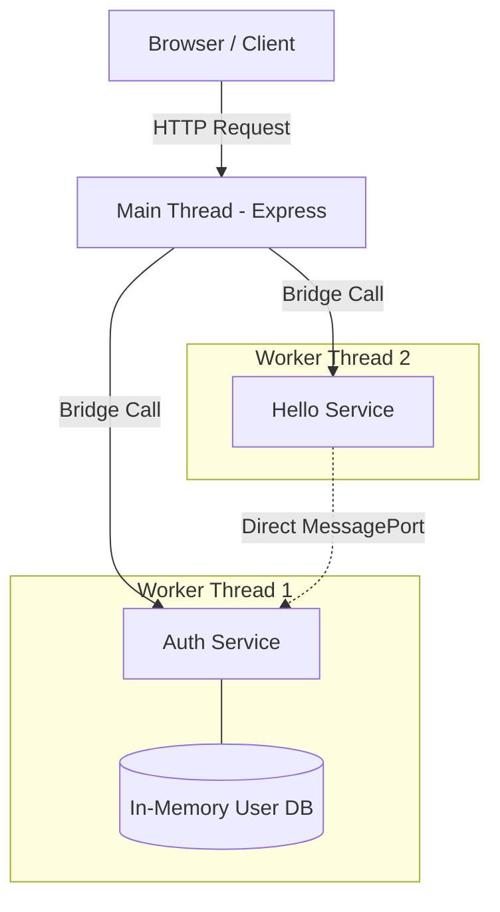

# Express Bridge Example

This example demonstrates how to build a robust, multi-threaded Node.js application using **Express** and **Service Bridge**.

It showcases a "Golden Path" architecture where business logic runs in isolated Worker Threads, keeping the Main Thread free to handle HTTP traffic and static asset serving.

## 🌟 Key Concepts

1.  **Main Thread as Gateway:** The Main Thread runs Express. It handles incoming HTTP requests and "routes" them to the appropriate Worker Service. It does *not* execute business logic.
2.  **Isolated Services:** `Auth` and `Hello` run in their own threads. A crash or heavy computation in one will not block the Express server or the other service.
3.  **Worker-to-Worker Communication:** This is the most critical feature. The `Hello` service communicates *directly* with the `Auth` service via a dedicated `MessagePort`. Data flows between them without ever touching the Main Thread.

## 🏗 Architecture



## 📂 Major Components

### 1. `src/index.ts` (The Orchestrator)
This is the entry point. Its job is to:
*   Start the Express server.
*   Spin up the worker threads (`startAuth`, `startHello`).
*   **Wire them together:** It passes a port from `Auth` to `Hello` so they can talk directly.
*   Route HTTP endpoints to Service functions using the adapter.

### 2. `src/expressAdapter.ts`
A small utility that acts as the "Glue" between Express and Service Bridge. It takes a `ServiceResponse` (internal format) and converts it to an Express Response (HTTP status codes, JSON body).

### 3. `src/services/auth.ts` (The State Holder)
A service that manages user state. Since it runs in its own thread, the `users` array is completely isolated. It exposes methods like `login` and `getUser`.

### 4. `src/services/hello.ts` (The Consumer)
A service that demonstrates **dependency**. It needs to verify tokens, so it calls `Auth`.
*   **Crucial Pattern:** It accepts the `Auth` service (or a proxy to it) via its `configure` method. This is "Late Binding" Dependency Injection tailored for workers.

## 🚀 Running the Example

1.  **Install Dependencies:**
    ```bash
    npm install
    ```

2.  **Start the Server:**
    ```bash
    npm start
    ```

3.  **Open the App:**
    Visit `http://localhost:8080` in your browser.

    *   **Username:** `admin`
    *   **Password:** `123456`

## 🧠 Things to Look For in the Code

*   **`hello.configure(...)` in `index.ts`:** This is where the direct connection is established.
*   **`toExpress(...)`:** Notice how simple the route handlers become.
*   **`ServiceResponse`:** The services return generic response objects, making them framework-agnostic. You could swap Express for Fastify or WebSocket without changing the services.
